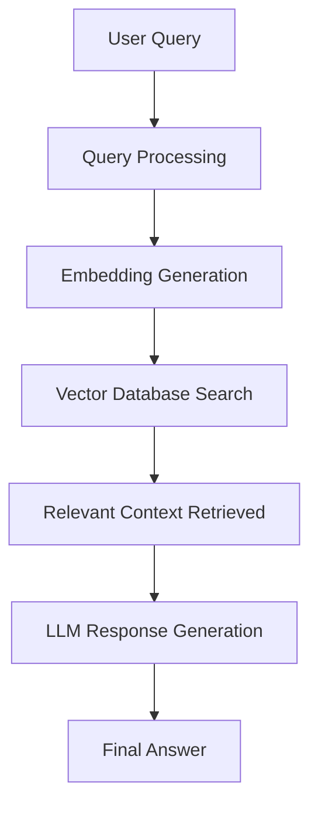

#  My RAG System (Retrieval-Augmented Generation)

[](https://www.python.org/)
[]()
[]()
[]()

A powerful **Retrieval-Augmented Generation (RAG) system** that combines **information retrieval + large language models (LLMs)** to generate accurate, context-aware answers from custom data sources.

This project demonstrates how modern AI systems overcome LLM limitations by retrieving relevant information before generating responses.

---

##  Architecture



---

##  Key Features

*  Context-aware question answering
*  Custom knowledge base support
*  Fast semantic search using embeddings
*  LLM-powered response generation
*  Modular pipeline (Retrieval + Generation)
*  Supports document-based querying

---

##  Technology Stack

* **Language:** Python 3.10+
* **LLM:** OpenAI / HuggingFace Models
* **Embeddings:** Sentence Transformers / OpenAI
* **Vector Database:** FAISS / ChromaDB
* **Frameworks:** LangChain (if used)
* **Tools:** Jupyter Notebook / Python scripts

---

##  System Workflow

1️⃣ **User Query Input**

* User asks a question

2️⃣ **Query Processing**

* Query is cleaned and converted into embeddings

3️⃣ **Context Retrieval**

* Vector database searches similar documents

4️⃣ **Relevant Context Selection**

* Top matching chunks are selected

5️⃣ **Answer Generation**

* LLM generates response using retrieved context

---

##  RAG Concept

Retrieval-Augmented Generation improves LLM responses by adding external knowledge:

* LLM alone → limited knowledge
* RAG → **real-time + accurate + context-based answers**

---

##  Installation

```bash
git clone https://github.com/basitsocial-sys/my-RAG.git
cd my-RAG
pip install -r requirements.txt
```

---

##  Usage

```bash
python main.py
```

OR (if notebook):

```bash
jupyter notebook
```

Run the main notebook/script to start querying your data.

---

##  Example

**Query:**
"What is machine learning?"

**Process:**

* Retrieve relevant documents
* Pass context to LLM

**Output:**
Accurate answer generated using your dataset

---

##  Project Structure

```
my-RAG/
│
├── data/                # Documents / dataset
├── embeddings/         # Stored vector embeddings
├── notebooks/          # Experiment notebooks
├── main.py             # Main pipeline
├── utils.py            # Helper functions
├── requirements.txt
└── README.md
```

---

##  Performance

* Efficient semantic search
* Scalable architecture
* Improved accuracy vs standard LLM
* Handles domain-specific queries

---

##  Applications

*  Document-based Q&A systems
*  Chatbots with custom knowledge
*  Enterprise knowledge assistants
*  Educational AI tools

---

##  Future Improvements

* Web UI (Streamlit / Flask)
* Real-time document upload
* Multi-language support
* Better ranking (re-ranking models)
* Performance optimization

---

##  requirements.txt

```txt
openai
langchain
faiss-cpu
chromadb
sentence-transformers
numpy
pandas
```

---

##  GitHub Description

RAG-based AI system for context-aware question answering using vector search and LLMs.

---

##  GitHub Topics

rag, llm, ai, vector-database, embeddings, langchain, question-answering, python, machine-learning

---

##  License

MIT License
